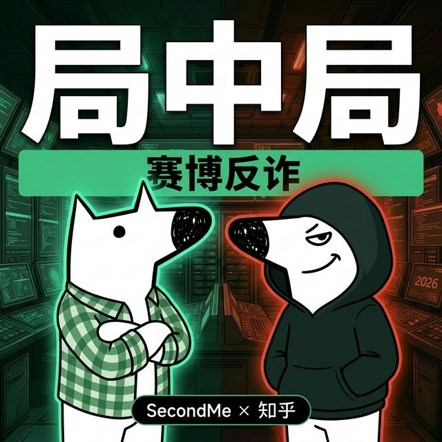

# 局中局：赛博反诈 (Game Within a Game: Cyber Anti-Fraud)



> **基于 SecondMe 画像引擎驱动的沉浸式 A2A 反欺诈模拟器。**
> A2A Cyber Anti-Fraud Simulator powered by SecondMe Agent.

## 📖 项目简介

传统反诈教育往往是说教式的，用户难以产生代入感。本项目创新性地提出“以模制模”的 A2A (Agent to Agent) 解决思路。

通过接入 **SecondMe** 平台获取用户的真实数字分身画像（职业、兴趣、近期活动），隐蔽地将这些具有极高个性化特征的数据作为上下文，注入到大模型的 System Prompt 中。大模型据此生成一个极度了解用户的“专属反诈靶机 Agent”（骗子/黑客）。

用户在对战大厅中与该专属“骗子”进行自然语言的剧本杀级沉浸式对抗测试。这种利用自身真实数据生成定制骗局的打靶方式，能够极大提升用户的警惕阈值，真正实现从“认知”到“实战免疫”的反诈闭环。

---

## 🎨 系统架构与技术栈

项目采用了极简的“防守/攻击”双阵营 2D 扁平化视觉，UI 还原了黑客松的纯粹极简赛博风格。无重度依赖，力求极速一键部署，专为黑客松演示优化。

- **前台框架**: 原生 HTML5 / CSS3 / Vanilla JavaScript
- **接口通讯**: SSE (Server-Sent Events) 打字机流式输出
- **后端服务**: Node.js + Express
- **动态渲染**: EJS 模板引擎
- **身份认证**: `mindverse-secondme-skills` / SecondMe OAuth 规范
- **AI 驱动核心**: 调用大型语言模型生成个性化剧本
- **视觉风格**: Shadcn 启发式半透明高斯模糊面板，B站科技区风格对峙图

---

## 🚀 极速本地部署

### 1. 克隆与安装
```bash
git clone git@github.com:leo142536/secondme-cyber-antifraud.git
cd secondme-cyber-antifraud
npm install
```

### 2. 环境配置
将源码中的 `.env.example` 复制为 `.env`，并填入你的配置信息：
```bash
cp .env.example .env
```
在 `.env` 中填写在 `develop.second.me` 申请的应用 `Client ID` 和 `Client Secret`，以及 LLM 密钥。

### 3. 本地启动
```bash
npm start
```
使用浏览器访问 `http://localhost:3000` 即可登入“赛博防骗大厅”。

---

## 🏆 Hackathon 亮点总结

1. **真实数据反噬（Data Reflection）**：不再是通用的生硬骗词。由 SecondMe 提取到的人设特征会让诈骗剧本前所未有地逼真。
2. **极简优雅的代码架构**：剥离所有非必要框架沉疴。最纯正的 HTML 加上优雅的原生 CSS V2 动画，保证加载的极速响应与任何环境下的兼容运作。
3. **黑客松级别的赛博网感**：精心设计的高对比红青色打光、代码化 UI 与命令行美学页面交互，精准契合极客社区的心智。

---

*SecondMe Hackathon 2026 参赛项目*
